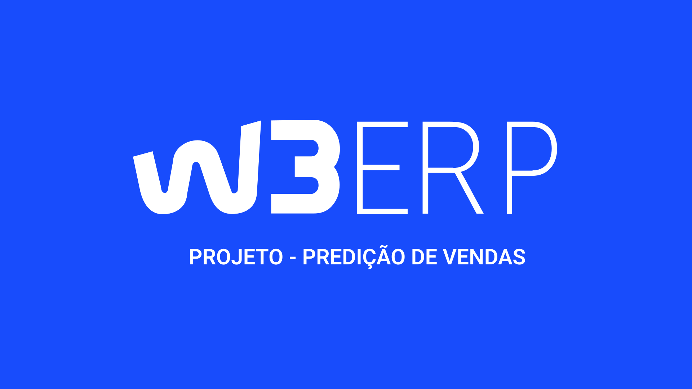

# w3_ERP

**MÓDULO 04 - w3 ERP**: Neste projeto, estou desenvolvendo o front-end de uma aplicação chamada "w3 ERP", um Sistema Integrado de Gestão Empresarial focado em predição de compras. Este trabalho concentra-se integralmente na interface do usuário, aplicando de forma prática os conceitos estudados ao longo do Módulo 04.

## Índice

- [Visão Geral](#visão-geral)
- [Tecnologias Utilizadas](#tecnologias-utilizadas)
- [Instalação e Configuração](#instalação-e-configuração)
- [Arquitetura do Projeto](#arquitetura-do-projeto)
- [Funcionalidades](#funcionalidades)
- [Scripts Disponíveis](#scripts-disponíveis)
- [Contribuindo](#contribuindo)
- [Licença](#licença)

## Visão Geral

O **w3 ERP** é um Sistema Integrado de Gestão Empresarial desenvolvido como parte do Módulo 04 do curso. O objetivo principal da aplicação é prever compras empresariais com base em dados preditivos. O projeto está focado no desenvolvimento do front-end, utilizando tecnologias modernas como React e TypeScript para criar uma interface de usuário eficiente e amigável.

## Tecnologias Utilizadas

- **React**: Biblioteca JavaScript para construção de interfaces de usuário.
- **TypeScript**: Superset do JavaScript que adiciona tipagem estática ao código.
- **Vite**: Ferramenta de build rápida para desenvolvimento de projetos com React.
- **Styled-Components**: Biblioteca para estilização de componentes utilizando CSS-in-JS.
- **React Router**: Biblioteca para gerenciamento de rotas.
- **Axios**: Cliente HTTP para fazer requisições à API.
- **Eslint**: Ferramenta para análise estática de código, usada para identificar padrões problemáticos.
- **Prettier**: Ferramenta de formatação de código.

## Instalação e Configuração

### Pré-requisitos

- Node.js (versão 14 ou superior)
- npm ou yarn

### Passos para instalação

1. Clone o repositório:

   ```bash
   git clone https://github.com/seu-usuario/w3_ERP.git
   ```

2. Acesse a pasta do projeto:

   ```bash
   cd w3_ERP
   ```

3. Instale as dependências:

   ```bash
   npm install
   ```

   ou

   ```bash
   yarn install
   ```

4. Inicie o servidor de desenvolvimento:

   ```bash
   npm run dev
   ```

   ou

   ```bash
   yarn dev
   ```

5. Acesse a aplicação em `http://localhost:5173/`.

## Arquitetura do Projeto

A estrutura do projeto segue o modelo baseado em componentes e separação de responsabilidades. Abaixo está um resumo das principais pastas e arquivos do projeto:

```
w3_ERP/
├── node_modules/
├── src/
│   ├── assets/         # Imagens, ícones e outros recursos estáticos
│   ├── components/     # Componentes reutilizáveis da interface de usuário
│   ├── mocks/          # Dados mockados para simular a API
│   ├── pages/          # Páginas principais da aplicação
│   ├── routes/         # Configuração das rotas da aplicação
│   ├── services/       # Comunicação com APIs e outras fontes de dados
│   ├── styles/         # Estilos globais e tema do projeto
│   └── types/          # Tipagem de componentes utilizados no projeto
│   ├── App.tsx         # Componente principal da aplicação
│   ├── main.tsx        # Arquivo de entrada do projeto
├── .gitignore          # Arquivos e diretórios ignorados pelo Git
├── eslint.config.js    # Configuração do ESLint
├── index.html          # Documento HTML principal
├── LICENSE             # Licença do projeto
├── package.json        # Dependências e scripts do projeto
├── README.md           # Documentação do projeto
├── tsconfig.json       # Configurações do TypeScript
└── yarn.lock           # Arquivo de bloqueio do Yarn
```

### Fluxo de Dados

A aplicação segue um fluxo de dados unidirecional, utilizando hooks como `useState` e `useEffect` para gerenciar o estado dos componentes e fazer requisições para APIs.

## Funcionalidades

- **Exibição de Produtos**: Listagem de produtos com previsão de esgotamento e histórico de compras.
- **Filtragem de Produtos**: Filtra os produtos com base em critérios predefinidos.
- **Formatação de IDs**: IDs de produtos formatados para melhor visualização.

## Scripts Disponíveis

No diretório do projeto, você pode executar:

- `npm run dev` ou `yarn dev`: Inicia a aplicação no modo de desenvolvimento.
- `npm run build` ou `yarn build`: Cria um build otimizado para produção.
- `npm run lint` ou `yarn lint`: Executa o ESLint para encontrar e corrigir problemas de estilo de código.
- `npm run format` ou `yarn format`: Formata o código utilizando o Prettier.

## Contribuindo

Se você deseja contribuir com este projeto, siga os passos abaixo:

1. Faça um fork do projeto.
2. Crie uma nova branch (`git checkout -b feature/nova-funcionalidade`).
3. Faça suas alterações e commit (`git commit -m 'Adiciona nova funcionalidade'`).
4. Envie para o branch (`git push origin feature/nova-funcionalidade`).
5. Abra um Pull Request.

## Licença

Este projeto está licenciado sob a Licença MIT - consulte o arquivo `LICENSE` para mais detalhes.
